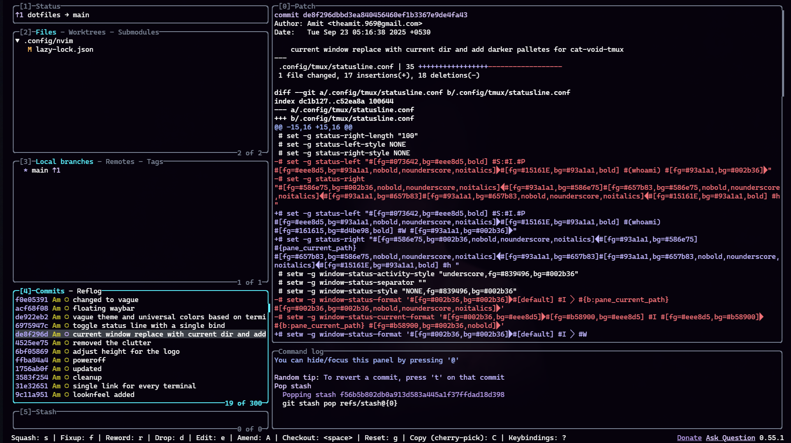

# 👾 Void Theme for Omarchy

A thoughtfully crafted theme for [Omarchy](https://omarchy.org)
with subtle purples, soft contrasts, and gentle highlights  made to feel calm, inviting, and keep you focused on what matters.

> *"In the void, only your code matters. Everything else fades away."*
>
## Preview

| Lazygit |  BTOP   | Walker     |
|:---:|:---:|:---:|
|  |  |  |


---

## Color Palette


---

## Installation

```bash
omarchy-theme-install https://github.com/vyrx-dev/omarchy-void-theme.git
```
