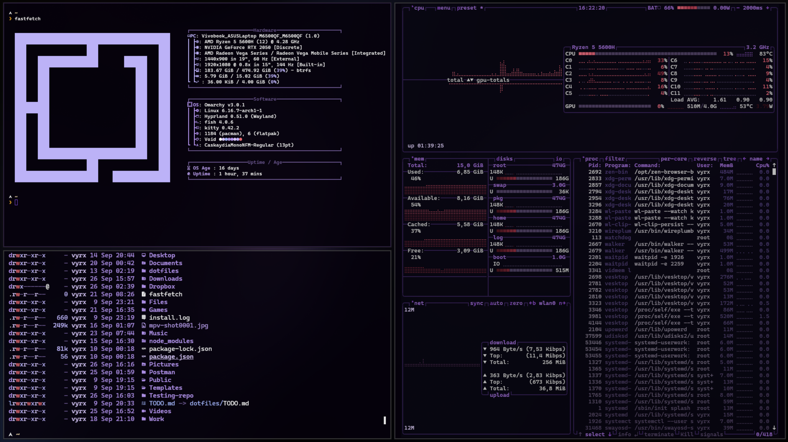

# Void theme for Omarchy

Void is a theme for [Omarchy](https://omarchy.org) inspired by purple void color palettes. It focuses on deep, low-contrast purples and soft accents for a calm, focused UI.

## Preview

<br>


## Installation

To install this theme, simply use the `omarchy-theme-install` command:

```bash
omarchy-theme-install https://github.com/vyrx-dev/omarchy-void-theme.git
```
